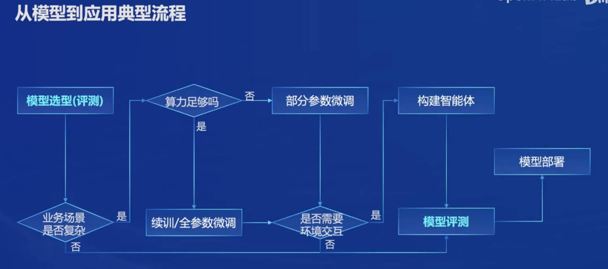
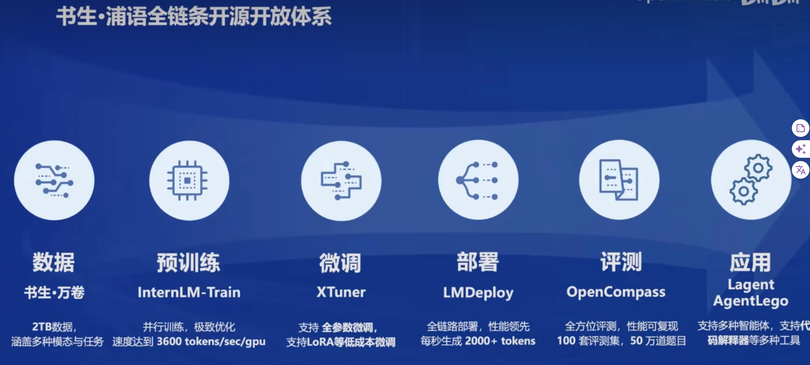
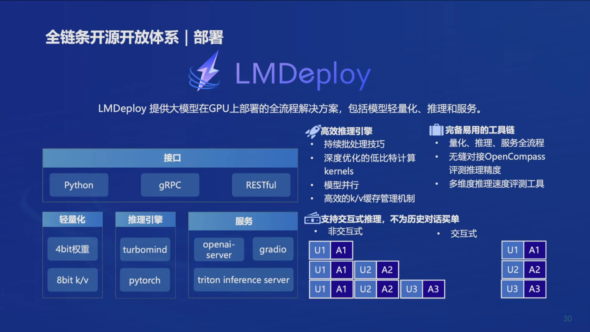
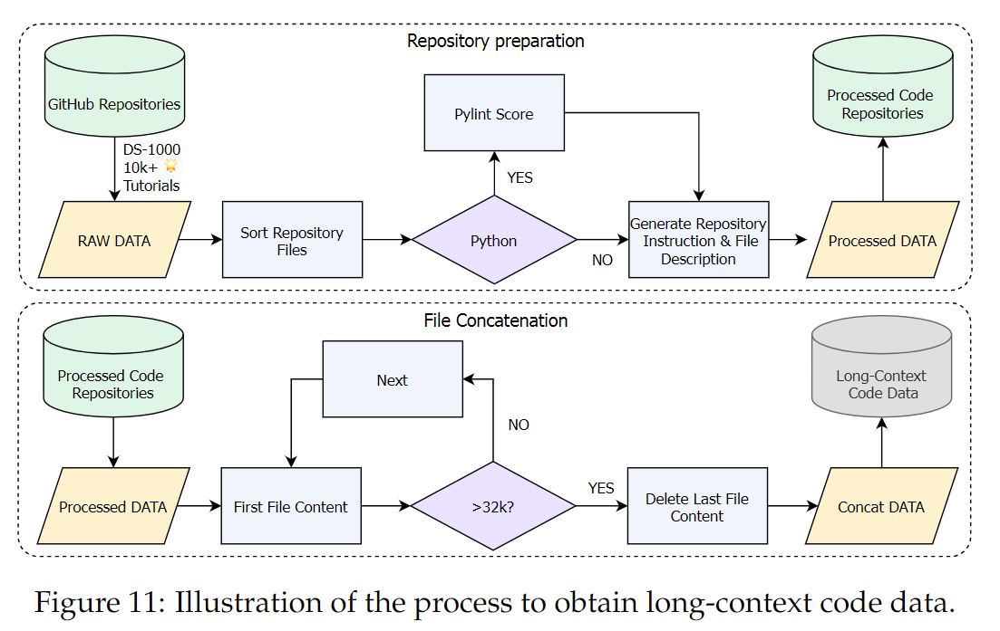

# InternLM2-Tutorial-Assignment

# Lecture 1
# 第一节课 《书生·浦语大模型全链路开源体系》
[视频](https://www.bilibili.com/video/BV1Vx421X72D/)   2024.3.27 

## 第一节课 笔记  
对于从模型到应用，基于医疗保健Agent项目的实际情况:  
先要对国内相关的模型进行测评，根据测评结果选择一款模型；业务场景是复杂的，在算力不足的情况下，对模型进行部分参数微调，需要进行环境交互，构建智能体；进行测评后，进行部署应用。  
   

基于书生·万卷和和行业专用知识库，用XTuner对模型过行微调，用Lagent和Aagentlego 构建智能体，再用OpenCompass进行评测，效果满意后，用LMDeploy进行布署。

| 模型选型（评测） | 数据集 | 参数微调 | 构建智能体 | 模型评测 | 模型部署 |
---
| OpenCompass  | 书生·万卷 | XTuner | Lagent Agentlego | OpenCompass | LMDeploy |    
---

  

  

## 第一节课 作业
课程及 InternLM2 技术报告笔记   
[InternLM2 技术报告](https://arxiv.org/pdf/2403.17297.pdf)  

这份文件是关于InternLM2的详细技术报告，InternLM2是由上海人工智能实验室、SenseTime集团、香港中文大学以及复旦大学共同开发的一款开源大型语言模型（LLM）。报告详细介绍了InternLM2的设计、训练过程、性能评估和对齐策略等方面的信息。

#### 报告的核心内容概述：  

InternLM2的介绍：

InternLM2是一款性能超越前辈模型的开源大型语言模型，它在六个维度和30个基准测试中表现出色，包括长文本建模和开放式主观评估。
该模型通过创新的预训练和优化技术，有效捕捉长期依赖关系，并在预训练和微调阶段展示了卓越的性能。

基础设施：

使用了名为InternEvo的高效轻量级预训练框架，支持在数千个GPU上进行模型训练。
InternEvo结合了数据并行、张量并行、序列并行和流水线并行，以及Zero Redundancy Optimizer (ZeRO) 策略，以提高GPU内存效率。

预训练：

详细介绍了预训练数据的准备，包括文本数据、代码数据和长文本数据的处理。
预训练分为三个阶段：4k上下文训练、长文本训练和特定能力增强训练。

对齐：

通过监督式微调（SFT）和人类反馈强化学习（RLHF）确保模型遵循人类指令并与人类价值观保持一致。
引入了条件在线RLHF（COOL RLHF）策略，通过条件奖励模型解决冲突的人类偏好，并减少奖励黑客行为。

评估与分析：

对InternLM2在下游任务上的性能进行了全面评估，包括综合考试、语言和知识、推理和数学、编码等。
对模型在对齐任务上的性能进行了评估，包括英语和中文的主观评估、指令遵循评估以及条件奖励模型的消融研究。

数据污染讨论：

讨论了数据污染对模型性能和可靠性的潜在影响，并提出了相应的解决方案。
报告还包含了对InternLM2模型在不同训练阶段的开源承诺，以及对未来研究的启示。此外，报告提供了评估中使用的提示样本，以及如何构造提示以评估模型对数学概念的理解、在CIBench中使用外部工具的能力等。

整体而言，这份技术报告提供了InternLM2大型语言模型的全面介绍，包括其开发背景、技术细节、性能评估和未来研究方向，为开源社区提供了宝贵的资源和见解。
